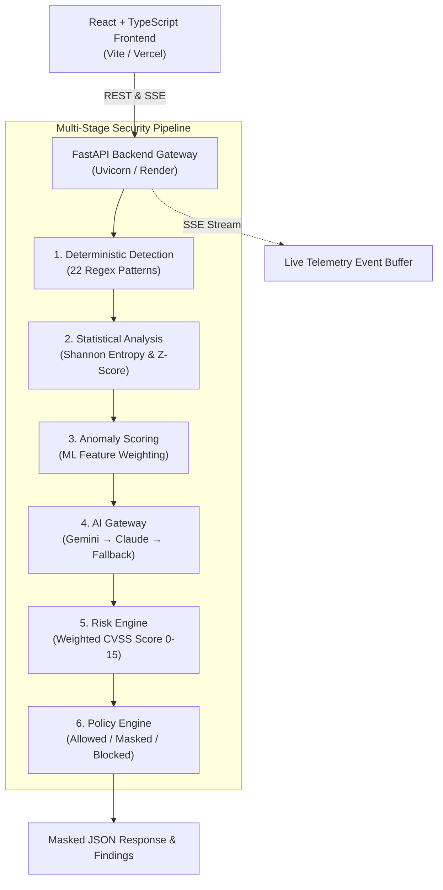

# 🛡️ AI Secure Data Intelligence Platform

An intelligent multi-stage security analysis platform designed to detect sensitive data leaks, exposed credentials, injection attempts, and anomalous behavior across plain text, logs, SQL queries, and chat streams with automated risk scoring and policy enforcement.

[](https://python.org)
[](https://fastapi.tiangolo.com)
[](https://react.dev)
[](https://www.typescriptlang.org)
[](file:///tests)
[](LICENSE)

- **Live Demo (Frontend):** [https://sisa-hackathon.vercel.app/](https://sisa-hackathon.vercel.app/)
- **Live Backend API:** [https://secureai-backend-3yg7.onrender.com/](https://secureai-backend-3yg7.onrender.com/)
- **Swagger Documentation:** [https://secureai-backend-3yg7.onrender.com/docs](https://secureai-backend-3yg7.onrender.com/docs)
- **Source Code:** [https://github.com/Kondareddy1209/AI_Secure_Data_Intelligence_Platform](https://github.com/Kondareddy1209/AI_Secure_Data_Intelligence_Platform)

---

## 🎥 Demo

> 🎥 Demo video coming soon.

---

## 🖥️ Screenshots

> Screenshots coming soon.

---

## 🎯 Overview

Modern applications process high volumes of unstructured data that risk leaking secrets, credentials, and PII. The **AI Secure Data Intelligence Platform** provides a defense-in-depth analysis pipeline combining deterministic regex rules, statistical variance tracking, ML-style anomaly scoring, and resilient AI contextual analysis to evaluate payloads and enforce data governance policies in real time.

---

## ✨ Key Features

- **Multi-Format Ingestion:** Native analysis pipelines for `text`, `file`, `sql`, `log`, and `chat` inputs.
- **22 High-Precision Regex Detectors:** Targeted detection for API keys, AWS credentials, JWTs, private keys, connection strings, database passwords, and PII (SSN, credit cards).
- **Statistical & Entropy Analysis:** Shannon entropy calculation for high-entropy tokens and Z-score outlier detection for credential density and failure spikes.
- **Isolation-Forest-Inspired ML Scoring:** Feature extraction pipeline weighing keyword densities, character distributions, and structural variance to spot complex attack signatures.
- **Resilient AI Gateway:** Unidirectional fallback architecture (`Gemini` → `Claude` → `Rule-Based Fallback`) ensuring analysis never fails even during AI service downtime.
- **Automated Policy Enforcement:** Configurable actions (`ALLOWED`, `MASKED`, `BLOCKED`) based on CVSS-aligned risk scores (0–15 scale) and user risk tolerance.
- **Real-Time Telemetry:** In-memory circular log ring buffer broadcasting live server events over Server-Sent Events (SSE).

---

## 🏗️ Architecture



---

## ⚡ Performance

- **Lightweight & Fast:** Core deterministic and statistical detections execute in under 20ms locally.
- **Non-Blocking Telemetry:** Asynchronous SSE broadcasting with an in-memory 100-event circular queue.
- **Zero-Crash Resilience:** All external AI interactions are timeout-protected and isolated from core detection logic.

---

## 🛠️ Tech Stack

| Domain | Technologies |
|---|---|
| **Frontend** | React 18, TypeScript, Vite, Vanilla CSS Design System |
| **Backend** | Python 3.11, FastAPI, Pydantic v2, Uvicorn, SlowAPI |
| **AI Gateway** | Google Generative AI (Gemini), Anthropic Claude SDK |
| **Data Processing** | Chardet, PyPDF2, Python-Docx |
| **Testing** | Pytest, Pytest-Asyncio, Fastapi TestClient |
| **Deployment** | Docker, Docker Compose, Vercel (Frontend), Render (Backend) |

---

## 🔌 API Reference

### Core Endpoints

| Method | Endpoint | Description |
|---|---|---|
| `GET` | `/` | Service metadata and available endpoint index |
| `GET` | `/health` | Application status, version, and environment |
| `GET` | `/patterns` | List of 22 active detection pattern rules and severity |
| `POST` | `/analyze` | Main multi-stage inspection endpoint |
| `GET` | `/api/logs/history` | Retrieve the last 100 system audit logs |
| `GET` | `/api/logs/stream` | Real-time Server-Sent Events (SSE) log stream |

### Sample Analysis Request

```bash
curl -X POST "http://localhost:8000/analyze" \
  -H "Content-Type: application/json" \
  -d '{
    "input_type": "text",
    "content": "api_key=sk-EXAMPLE000000000 password=SECRET_PASS",
    "options": {
      "mask": true,
      "block_high_risk": true,
      "use_ai": false
    }
  }'
```

---

## 🚀 Getting Started

### Prerequisites
- Python 3.11+
- Node.js 18+
- Docker (Optional)

### 1. Backend Setup
```bash
cd backend
cp .env.example .env
pip install -r requirements.txt
python -m uvicorn app.main:app --reload --port 8000
```
Backend runs at `http://localhost:8000` (Docs at `http://localhost:8000/docs`).

### 2. Frontend Setup
```bash
cd frontend
npm install
npm run dev
```
Frontend development server runs at `http://localhost:5173`.

### 3. Docker Compose Setup
```bash
docker-compose up --build
```
- Backend: `http://localhost:8000`
- Frontend: `http://localhost:3000`

---

## 🔐 Environment Variables

| Variable | Description | Default / Example |
|---|---|---|
| `GEMINI_API_KEY` | Google Gemini API key for primary AI insights | `your_gemini_api_key_here` |
| `ANTHROPIC_API_KEY` | Anthropic Claude API key for secondary AI fallback | `your_anthropic_api_key_here` |
| `AI_PROVIDER` | Default AI provider preference | `gemini` |
| `CLAUDE_MODEL` | Claude model identifier | `claude-3-5-sonnet-20241022` |
| `ENVIRONMENT` | Deployment environment | `development` / `production` |
| `APP_VERSION` | Application version tag | `1.0.0` |
| `MAX_FILE_SIZE_MB` | Maximum file upload size in MB | `10` |
| `ALLOWED_ORIGINS` | Comma-separated CORS allowed origins | `http://localhost:3000,http://localhost:5173` |
| `FRONTEND_URL` | Production frontend domain for CORS | `https://sisa-hackathon.vercel.app` |
| `REQUIRE_API_BEARER_TOKEN`| Enable token validation on public endpoints | `false` |
| `API_BEARER_TOKEN` | Bearer token secret when authentication is enabled | `your_secure_bearer_token_here` |

---

## 🧪 Testing

Run backend test suite:
```bash
pytest backend/tests/ -v
```

Run frontend type check & production build:
```bash
cd frontend
npm run build
```

---

## 📚 Project Structure

```
AI_Secure_Data_Intelligence_Platform/
├── backend/
│   ├── app/
│   │   ├── api/routes/          # Route controllers (analyze, health, logs)
│   │   ├── core/                # Configuration and environment settings
│   │   ├── middleware/          # Request telemetry and latency logging
│   │   ├── models/              # Pydantic request/response schemas
│   │   ├── modules/
│   │   │   ├── ai/              # Gemini & Claude AI gateway with fallback
│   │   │   ├── detection/       # Regex (22 rules), statistical, & ML detectors
│   │   │   ├── policy/          # Policy enforcement & redaction masking
│   │   │   └── risk/            # Risk scoring & severity classification
│   │   └── utils/               # Structured logging & SSE broadcasting
│   ├── tests/                   # Pytest test suite
│   ├── Dockerfile
│   └── requirements.txt
├── frontend/
│   ├── src/
│   │   ├── components/          # Input panels, dashboard, & results viewer
│   │   ├── services/            # API integration and SSE stream listener
│   │   └── types/               # TypeScript interfaces
│   ├── Dockerfile
│   └── package.json
├── docker-compose.yml
├── pytest.ini
└── README.md
```

---

## 👤 What I Built

> **Solo Full-Stack Developer**

- **FastAPI Core Engine:** Architected asynchronous REST API with unified payload processing across text, file, SQL, log, and chat inputs.
- **Multi-Stage Detection Engine:** Built 22 deterministic regex security patterns, statistical Shannon entropy analysis, and Isolation-Forest-inspired anomaly scoring.
- **Resilient AI Gateway:** Engineered a unidirectional fallback pipeline (`Gemini` → `Claude` → `Rule-based fallback`) ensuring high reliability and zero downtime.
- **Risk & Policy Engine:** Implemented weighted CVSS-aligned risk calculation (0–15) with automated policy enforcement (`ALLOWED`, `MASKED`, `BLOCKED`).
- **Live Telemetry & SSE:** Designed real-time event streaming via Server-Sent Events with an in-memory ring buffer.
- **React 18 + TypeScript Frontend:** Developed an interactive dashboard with dynamic findings inspection, risk breakdowns, log viewers, and JSON/CSV exports.
- **Test Automation & Docker Deployment:** Created automated test suites and multi-stage containerized deployments for Vercel and Render.

---

## 🗺️ Roadmap

- [ ] Support for custom enterprise regex pattern rule upload via dashboard.
- [ ] Exportable executive audit reports in PDF format.
- [ ] Optional webhook notifications for `CRITICAL` risk alerts.
- [ ] Role-based access control (RBAC) with API key management.

---

## 📄 License

This project is licensed under the MIT License.
